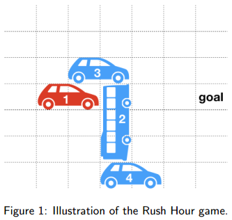

An A* solver for the Rush Hour puzzle game
----------------------------------------------------------

This was a piece of coursework for my year 3 Artificial Intelligence module. 

The task was to implement an A* solver for the puzzle game Rush Hour, by extending the
partial java implementation that was provided.

I got 100% for this piece of work.

**Rush Hour**

Rush Hour is a puzzle game in which the player needs to move a number of cars to allow a 
designated target car to reach the exit of a car park. 

The aim of the puzzle is always to move the target car to the right-most column of the 
grid. The target car can only be moved horizontally. Each of the other cars can be moved 
either horizontally or vertically, depending on their orientation.

An example of a Rush Hour puzzle is shown below, with target car shown in red:

In this example, a possible solution would be:
1. move car 3 one step to the left, 
2. move car 2 three positions upwards, 
3. move car 1 four positions to the right.

**Game encodings**

Levels are encoded as plain text files, found in the 'game_encodings' directory.

An example encoding:

    6
    7
    2 3 1 H 
    0 4 2 H 
    3 5 3 V

* The first line contains the number of rows of the grid
* The second line contains the number of columns
* The next line contains the initial position of the target car
* All following lines encode initial positions of the blocking cars
* Cars are encoded as: row, column, length and orientation of the car (H=horizontal, V=vertical). Nb- the orientation of the target car is always be horizontal.

________

**To run:**

1. Compile all files:
javac */*.java

2. Run RushHour, specifying game encoding to use, e.g. random1.txt:
java -Xmx1g rushhour/RushHour game_encodings/random1.txt

